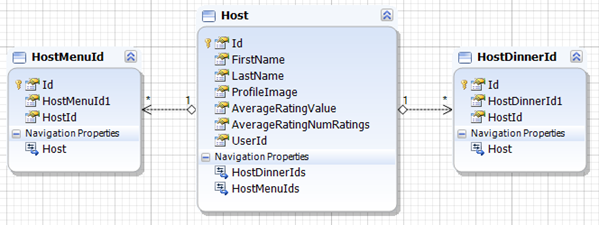
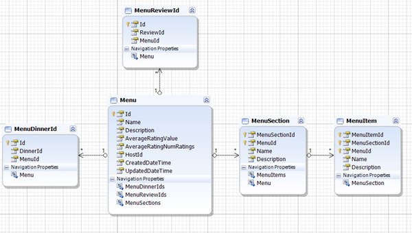
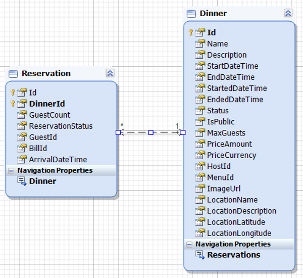
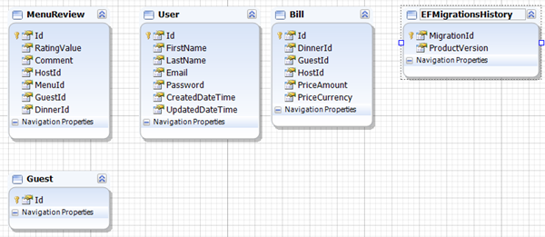

# BuberDinner
## Overview
This repository follows course from YouTube on channel named `Amichai Mantinband` [(link)](https://www.youtube.com/channel/UClz49zOCnzsclUJY-t62lIw). The course's name is `REST API Following CLEAN ARCHITECTURE & DDD` [(link)](https://www.youtube.com/watch?v=fhM0V2N1GpY&list=PLzYkqgWkHPKBcDIP5gzLfASkQyTdy0t4k).
I have updated the original repository so that it is more developer-friendly. I also plan to add some missing functionality.

## About applications
Application is written in .NET 6.0 with C# using WebAPI technology. This solutions follows Clean Architecture principles and Domain-Driven Design principles. It contains 4 layers:
 - Domain
 - Application
 - Infrastructure
 - Api
 
More information about DDD and the project can be found [here](https://github.com/AlexNek/ddd-for-developers).

## Build and run
You can run the application in two ways:
1. Local application
> **Note**: This way need to have separate database running on your local machine for some requests. Go to `infrastructure` project and run command `dotnet ef database update` for database creation. As an alternative, you can use sql file added to the project.

To run this project you need to have .NET 6.0 runtime installed. Then clone (or download) this repository.\
Then open CLI and open folder with application. Then run from CLI with command: `dotnet run --project .\BuberDinner.Api\`

2. Docker

Application has `docker-compose` file for running the application with MSSQL Server database in container. \
To run the application using Docker you have to have it installed on your machine. Then close (or downlaod) this repository. \
In the main folder type the command:
```
docker-compose up -d --build
```

In both ways of running the application, you have to use migrations for creating tables to fully use the application.

After browser opening you can use swagger to test api. Don't forget to use autorization token

## Implemetation notes

At this point, all users stored in memory, so you need to register user every time after start.
No menu reading implemented now.

## Database design





## Changes
- Securely store user password in database
- Save the user in the database
- added swagger entry point